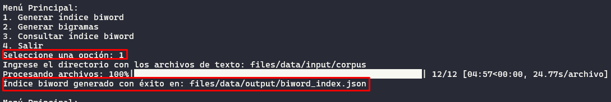

# Biword Index

## Configuración inicial

### [Installing NLTK](https://www.nltk.org/install.html)
```bash
pip install -U nltk
```

### [Installing Third-Party Software](https://github.com/nltk/nltk/wiki/Installing-Third-Party-Software)

NLTK encuentra software de terceros a través de variables de entorno o mediante argumentos de ruta mediante llamadas a la API. Esta página enumera las instrucciones de instalación y sus variables de entorno asociadas.

### JAVA
NLTK no requiere Java, pero es posible que algún software de terceros dependa de él. NLTK encuentra el binario de Java a través de la `PATH` variable de entorno del sistema o mediante `JAVAHOME` o `JAVA_HOME`.

#### Actualizar el sistema
```bash
sudo apt update
```

#### Instalar Java
```bash
sudo apt install default-jdk
```

#### Verificar la instalación
```bash
java -version
```

#### Configurar variables de entorno
- Encuentra la ruta de Java con:
```bash
readlink -f /usr/bin/java | sed "s:bin/java::"
```

- Luego, abre `~/.bashrc` y añade la siguiente línea, reemplazando `/path/to/java` por la ruta que obtuviste:
```bash
export JAVA_HOME=/path/to/java
export PATH=$JAVA_HOME/bin:$PATH
```

- Aplica los cambios con:
```bash
source ~/.bashrc
```

### [Installing NLTK Data](https://www.nltk.org/data.html)
Después de instalar el paquete NLTK, instale los conjuntos de datos/modelos necesarios para que funcionen las funciones específicas.

Si no está seguro de qué conjuntos de datos/modelos necesitará, puede instalar el subconjunto “popular” de datos NLTK

```bash
python -m nltk.downloader popular
```

#### [Manual installation](https://www.nltk.org/data.html#manual-installation)
Download individual packages from `https://www.nltk.org/nltk_data/` (see the “download” links). Unzip them to the appropriate subfolder. For example, the Brown Corpus, found at: ~ `https://raw.githubusercontent.com/nltk/nltk_data/gh-pages/packages/corpora/brown.zip` is to be unzipped to `nltk_data/corpora/brown`.

- [Punkt Tokenizer Models](https://raw.githubusercontent.com/nltk/nltk_data/gh-pages/packages/tokenizers/punkt_tab.zip)

    Attempted to load tokenizers/punkt_tab/spanish/  
    Searched in:  
        - '/root/nltk_data'  
        - '/home/github/biword_index/venv/nltk_data'  
        - '/home/github/biword_index/venv/share/nltk_data'  
        - '/home/github/biword_index/venv/lib/nltk_data'  
        - '/usr/share/nltk_data'  
        - '/usr/local/share/nltk_data'  
        - '/usr/lib/nltk_data'  
        - '/usr/local/lib/nltk_data'  

### [Descargar un servidor para usar tika](https://tika.apache.org/download.html)
Apache Tika 3.0.0 is now available.

Se esta utilizando el servidor [Mirrors for tika-server-standard-3.0.0.jar](https://www.apache.org/dyn/closer.lua/tika/3.0.0/tika-server-standard-3.0.0.jar)

#### Consideraciones:

- Inicie un servidor en un puerto distinto al `9998` por si este se encuentre ocupado.
- Si necesita iniciar un servidor de mayor capacidad, utilice el comando `-Xmx4g`.
```bash
java -jar files/tika/tika-server-standard-3.0.0.jar -p 9999
java -Xmx4g -jar files/tika/tika-server-standard-3.0.0.jar -p 9999
```

- Verificar si un puerto se encuentra en uso:
```bash
sudo lsof -i :9998
```

- Detener la ejecución de un puerto o forzar el cierre con: `-9`
```bash
sudo kill 32065
sudo kill -9 32065
```

#### Instalación de dependencias
```bash
python pip install -r requirements.txt
```

## Ejemplos de usos

- Corre el programa con:
```bash
python main.py
```


Puede elegir entre generar el índice biword, generar bigramas y consultar el índice biword.

- **Escribir 1 para generar el índice biword**

Al escribir 1, debemos escribir la ruta donde esta ubicado la carpeta con los archivos a leer. Retornará el índice biword en formato json y un archivo txt con el contenido unido de todos los archivos, para generar los biwords mas importantes según un modelo específico.

- **Escribir 2 para generar bigramas**

Puede elegir entre 4 modelos para generar bigramas. Retornará un top 10 de bigramas.

- **Escribir 3 para realizar consultas al índice.**


## Referencias
- [Biword indexes](https://nlp.stanford.edu/IR-book/html/htmledition/biword-indexes-1.html)
- [Introduction to Information Retrieval](https://nlp.stanford.edu/IR-book/information-retrieval-book.html)
- [infoRetrieval](https://github.com/nglthu/infoRetrieval)
- [Positional-Index](https://github.com/cvhariharan/Positional-Index)